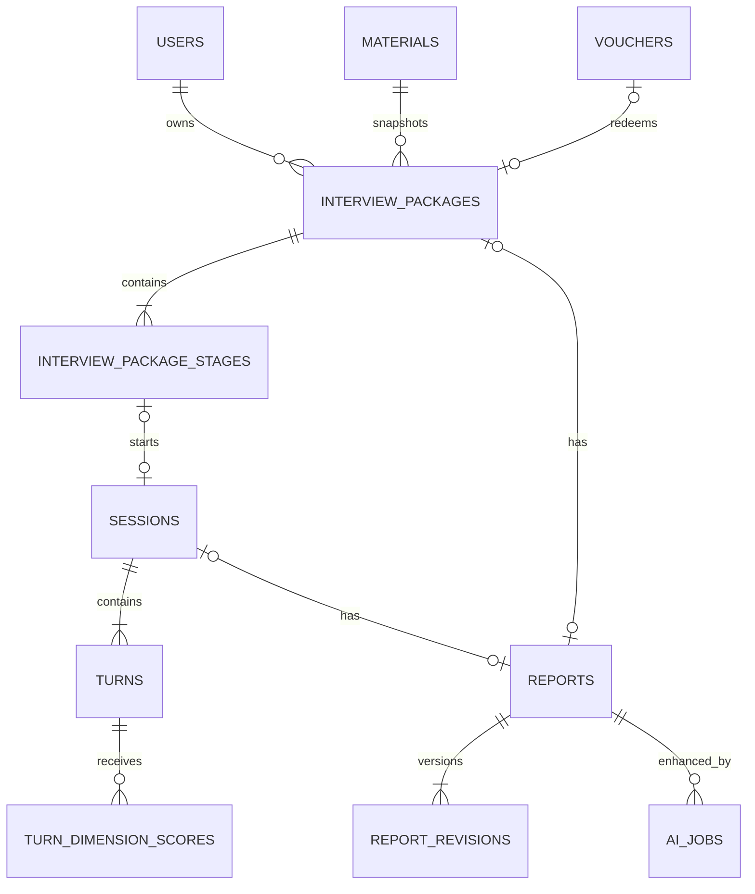
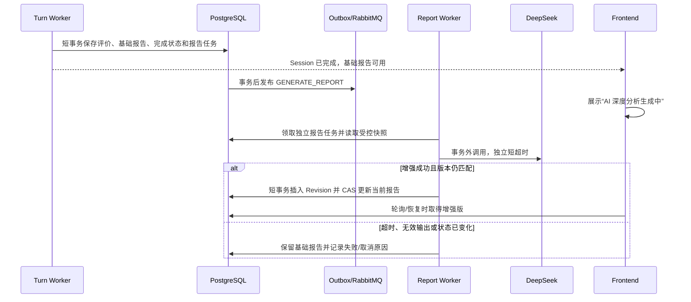

# 工作面试套餐与 AI 报告增强设计

日期：2026-07-16

## 1. 背景与决策

当前工作面试由一个 `job` Session 内的 6 个题目轮次组成，数据库无法表达技术一面、技术二面和 HR 面三个独立场次，也无法把前两场结论作为可信上下文交给 HR 面。当前未提交的 AI 报告摘要还在最终轮完成事务内发起第二次外部模型调用，虽然常规异常能回退规则模板，但仍会占用数据库锁和三分钟任务租约。

本设计作出以下产品决策：

1. `job` 仍是唯一的工作面试类型，不新增独立 HR 类型。
2. 一个工作面试套餐依次包含技术一面、技术二面、HR 面三个独立 Session。
3. 套餐创建时一次性扣除 3 次；一张 `job` 体验券覆盖整个套餐，二者互斥。
4. 套餐有效期 30 天；已经开始的单场最长 24 小时，且不得超过套餐截止时间。
5. 前一场完成后才解锁下一场；下一场 Session 在用户明确开始时延迟创建。
6. 简历与岗位材料在套餐创建时生成不可变安全快照，三个场次均可读取。
7. 后续场次只接收前序场次的结构化可信快照，不接收完整原始回答或报告全文。
8. 面试和套餐先生成立即可用的基础报告，再通过独立 `GENERATE_REPORT` 任务异步升级为 AI 增强报告。
9. 三个阶段采用“目标时长 + 最小/最大轮数 + 必答模块覆盖”的动态结束规则，不使用固定题数。
10. 技术一面的算法题由用户口述解题思路，不提供代码编辑、执行或判题能力。

国内企业的具体招聘流程会因岗位和组织而变化。产品采用“两轮专业面试 + 综合决策面”的通用骨架，并通过 `plan_version` 和 `rubric_version` 版本化，而不把某一家企业永久写死。参考资料：

- [华为招聘 FAQ](https://career.huawei.com/reccampportal/portal5/faq.html)：研发岗位通常包含两轮专业面试和业务主管面试。
- [字节跳动校招 FAQ](https://jobs.bytedance.com/campus/page-6272Gc)：不同岗位的笔试和面试安排存在差异。

## 2. 目标与非目标

### 2.1 目标

- 建立可事务约束的三场顺序、解锁和扣次模型。
- 让技术二面和 HR 面基于前序表现定向追问。
- 让 AI 报告失败、超时或重试不影响 Session/套餐完成。
- 建立稳定评分维度、证据和版本信息，为后续评测与趋势分析提供结构化数据。
- 保持非工作面试现有 Session 流程兼容。

### 2.2 非目标

- 不新增可由管理员在线编辑的 Prompt 或招聘流程设计器。
- 不为不同企业建立品牌化题库或承诺复刻某一家企业的真实面试。
- 不在本阶段实现加面、跳过阶段、重复刷同一阶段或自动退款。
- 不实现代码编辑器、在线编译器或不可信代码执行沙箱。
- 不保存音频，也不把完整原始回答复制到跨场快照。
- 不从文字转写推断 IELTS 发音能力。

## 3. 领域模型

工作面试套餐是计费、顺序和综合报告的一致性边界。Session 继续负责单场状态机，Turn 继续负责单道题目的回答与评价。非工作面试没有 Package，继续直接创建 Session。

## 4. 三场面试职责

### 4.1 技术一面 `TECHNICAL_FIRST`

- 目标 40–60 分钟，允许 8–12 个题目轮次。
- 基于简历和 JD 验证经历真实性、职责边界和基础能力。
- 必须覆盖自我介绍、简历核验、计算机基础、岗位知识和算法思路。
- 算法题由 DeepSeek 生成，用户口述数据结构选择、核心步骤、边界条件和复杂度；AI 通过极端输入、复杂度退化和替代方案追问验证思考深度。
- 追问项目背景、本人行动、技术选型、结果指标和岗位直接匹配。
- 产出已覆盖技术主题、事实证据、基础能力缺口和需要二面深挖的问题。

### 4.2 技术二面 `TECHNICAL_SECOND`

- 目标 45–75 分钟，允许 7–12 个题目轮次。
- 读取材料快照和一面可信快照，不重复已经充分覆盖的问题。
- 必须覆盖项目深挖、系统设计、技术取舍、故障复盘和业务影响；同一主题允许形成连续追问链。
- 深挖性能与安全、复杂协作和能力上限。
- 产出技术深度、工程判断、能力上限、协作证据和需要 HR 核验的风险主题。

### 4.3 HR 面 `HR_FINAL`

- 目标 15–30 分钟，允许 5–8 个题目轮次。
- 读取材料快照以及一面、二面的可信快照。
- 必须覆盖求职动机、稳定性、协作价值观、职业规划、薪资期望和技术面风险核验。
- 根据技术面证据定向核验协作方式、冲突处理和岗位期望。
- 不重新扮演技术面试官，但可以围绕技术面暴露的矛盾或证据不足进行综合追问。
- 不根据年龄、性别、婚育、地域等敏感属性形成歧视性结论。

## 5. 数据模型

### 5.1 新表 `interview_packages`

| 字段 | 约束与含义 |
|---|---|
| `id` | UUID 主键 |
| `user_id` | 用户外键，删除用户时级联 |
| `material_id` | 原始材料来源，可在材料删除时置空 |
| `voucher_id` | 整包核销的体验券，可空 |
| `start_idempotency_key` | 用户创建套餐幂等键 |
| `request_hash` | 幂等请求内容哈希 |
| `status` | `ACTIVE/COMPLETED/EXPIRED/CANCELLED` |
| `current_stage_code` | 当前可操作阶段 |
| `charged_credit` | 只能为 0 或 3；使用券时为 0 |
| `plan_version` | 三场流程与题型版本 |
| `rubric_version` | 评分规则版本 |
| `material_snapshot` | 有长度上限、对象类型检查的 JSONB 安全快照 |
| `version` | 乐观锁版本 |
| `expires_at` | 创建后 30 天 |
| `completed_at/content_erased_at` | 完成和内容擦除时间 |
| `created_at/updated_at` | 审计时间 |

关键约束：

- `UNIQUE(user_id, start_idempotency_key)`。
- 同一用户最多一个 `ACTIVE` 套餐，避免与现有开放 Session 约束产生歧义。
- `charged_credit = 3` 与 `voucher_id IS NULL` 同时成立，或 `charged_credit = 0` 与 `voucher_id IS NOT NULL` 同时成立。
- `material_snapshot` 只保存材料服务已经裁剪出的字段，例如岗位、JD 摘要、候选人摘要和关键词，不保存原始文件。

### 5.2 新表 `interview_package_stages`

| 字段 | 约束与含义 |
|---|---|
| `id` | UUID 主键 |
| `package_id` | 套餐外键 |
| `stage_code` | `TECHNICAL_FIRST/TECHNICAL_SECOND/HR_FINAL` |
| `sequence_no` | 固定为 1、2、3 |
| `status` | `LOCKED/UNLOCKED/IN_PROGRESS/COMPLETED/EXPIRED/CANCELLED` |
| `session_id` | 用户开始该阶段后关联的唯一 Session，可空 |
| `plan_snapshot` | 本阶段目标时长、轮数上下限、必答模块和结束规则 |
| `context_snapshot` | 解锁时固化的前序可信结论 |
| `min_turns/max_turns` | 阶段允许的题目轮数范围 |
| `target_duration_minutes` | 产品体验目标，不作为硬倒计时 |
| `version` | 乐观锁版本 |
| `unlocked_at/started_at/completed_at` | 阶段时间 |
| `created_at/updated_at` | 审计时间 |

每个套餐在创建时一次性插入三个阶段行。技术一面初始为 `UNLOCKED`，其余为 `LOCKED`。`UNIQUE(package_id, stage_code)`、`UNIQUE(package_id, sequence_no)` 和 `UNIQUE(session_id)` 保证结构完整。

阶段结束由服务端判定：达到 `min_turns`、必答模块全部覆盖且模型建议收束时可以完成；达到 `max_turns` 时强制完成。目标时长只用于计划说明和前端预期，不因用户停顿或网络等待强制结束场次。

### 5.3 修改计费表

- `credit_ledger` 新增 `related_package_id`，工作套餐扣次记录关联 Package 而非单场 Session。
- `vouchers` 新增 `redeemed_package_id`。
- Voucher 必须且只能关联 `redeemed_session_id` 或 `redeemed_package_id` 之一；`job` 券核销到 Package，其他类型继续核销到 Session。
- 套餐、余额扣减/券核销、账本记录和三个阶段行必须在一个事务中提交。

### 5.4 修改 `reports`

`reports` 从“仅属于 Session”扩展为“属于 Session 或 Package”：

- `session_id` 改为可空。
- 新增 `package_id`。
- 新增 `report_scope`：`SESSION/PACKAGE`。
- 新增 `generation_status`：`BASE_READY/ENHANCING/ENHANCED/ENHANCEMENT_FAILED`。
- 新增 `summary_source`：`TEMPLATE/AI`。
- 新增 `current_revision`、`prompt_version`、`rubric_version`、`enhanced_at`、`enhancement_error_code`。
- 使用 CHECK 保证 `session_id` 和 `package_id` 恰好一个非空，并分别建立唯一部分索引。
- `report_json` 继续作为当前投影，现有查询无需每次聚合 Revision。

### 5.5 新表 `report_revisions`

保存每次可展示报告的不可变版本：

- `report_id`、`revision_no`、`source`、`report_json`。
- `generated_job_id`、`provider_name`、`model_name`。
- `prompt_version`、`rubric_version`、`output_schema_version`。
- `created_at`。

基础报告写入 Revision 1。AI 增强成功后插入新 Revision，再以报告版本做 CAS 更新当前投影。失败不能覆盖基础版本。

### 5.6 新表 `turn_dimension_scores`

每个 Turn 可以在多个稳定能力维度上评分：

- `turn_id`、`dimension_code`、`score`。
- `evidence`：从回答中提炼并限制长度的证据摘要。
- `comment`、`rubric_version`、`created_at`。
- `UNIQUE(turn_id, dimension_code)`。

工作面试首版维度包括岗位匹配、技术基础、技术深度、系统设计、问题解决、结果意识、协作沟通和动机稳定性。不同阶段只启用适用维度，套餐报告按同一维度代码聚合。

### 5.7 修改 `turns`

动态题型和连续追问需要显式结构，不能继续只依赖 `round_name` 文本：

- 新增 `section_code`：对应服务端定义的必答模块。
- 新增 `question_type`：例如 `INTRODUCTION/KNOWLEDGE/ALGORITHM_REASONING/PROJECT_DEEP_DIVE/SYSTEM_DESIGN/BEHAVIORAL/HR_COMPREHENSIVE`。
- 新增 `topic_code`：标识已经覆盖的稳定主题，避免后续场次重复。
- 新增 `parent_turn_id`：连续追问指向被深挖的前序 Turn，可空。

算法题的回答仍保存为语音转写文本。报告必须表述为“算法思路评价”，不得宣称代码正确、已经编译或通过测试。

### 5.8 修改 AI 表

`ai_jobs` 新增：

- `package_id`：支持套餐报告任务和运维查询。
- `report_id`：明确增强目标。

`ai_call_logs` 新增：

- `operation`：`TURN_EVALUATION/REPORT_ENHANCEMENT/PACKAGE_REPORT`。
- `prompt_version`、`output_schema_version`。
- `validation_status`、`finish_reason`、`attempt_no`。

现有 Token、成本和 Provider Request ID 字段应由适配器尽可能填充。Prompt 正文、简历和回答不得进入日志。

### 5.9 暂缓表

以下能力有价值，但不进入第一轮迁移：

- `report_feedback`：用户对报告有用性、原因和人工纠错反馈。
- `interview_plan_versions`：数据库驱动的岗位/职级流程模板。
- 能力趋势聚合表：在真实查询量证明需要前，先从结构化维度按需统计。

## 6. 关键流程

### 6.1 创建套餐

1. API 校验 `job` 材料已就绪，锁定用户余额或可用 Voucher。
2. 生成受控 `material_snapshot`。
3. 插入 Package 和三个 Stage。
4. 有 `job` Voucher 时整包核销，否则原子扣 3 次并写账本。
5. 创建技术一面 Session 和第一题，Stage 进入 `IN_PROGRESS`。
6. 整个事务成功后向用户返回 Package 与当前 Session。

幂等重放必须返回同一 Package，不得再次扣次或核销券。

### 6.2 完成单场并解锁下一场

每轮 Worker 的短事务只做数据库工作：

1. 保存当前轮评价、维度评分和模块覆盖结果。
2. 由服务端校验最低轮数、最大轮数和必答模块覆盖，决定继续或收束。
3. 需要继续时插入下一题并恢复 Session 为可回答状态，本事务到此结束。
4. 允许收束时生成确定性基础 Session 报告和 Revision 1。
5. 标记 Session、当前 Stage 完成。
6. 从服务端校验后的维度、证据和主题生成下一阶段 `context_snapshot`。
7. 解锁下一 Stage，但不提前创建其 Session，也不开始 24 小时倒计时。
8. 创建独立 `GENERATE_REPORT` Job 和 Outbox 事件。
9. 最后一个 HR Stage 完成时，同时生成基础套餐报告、标记 Package 完成，并为 Session 报告和套餐报告分别创建增强任务。

任何模型调用都不得发生在该完成事务内。

### 6.3 开始后续场次

用户点击开始时，API 锁定 Package 与目标 Stage，验证前序已完成、Stage 已解锁、套餐未过期，再创建 Session。Session 截止时间为 `min(开始时间 + 24 小时, 套餐 expires_at)`。

AI Job 的 `input_ref` 固化以下内容：

- Package 的材料安全快照。
- 当前 Stage 的跨场上下文快照。
- 当前问题、回答和既往问题的受控快照。
- 当前阶段已覆盖模块、主题和连续追问链。
- `plan_version`、`rubric_version`、Prompt 版本和输出 Schema 版本。

### 6.4 报告异步增强

报告增强任务使用独立超时和租约，不共享逐轮评价调用的剩余租约。基础报告永远是用户可用结果。

## 7. 评分与可信上下文

模型输出从单一 `score/feedback` 升级为版本化结构：

- 总体分数。
- 固定维度分数。
- 每个维度的证据摘要。
- 优势、改进项、已覆盖主题和待核验风险。
- 下一问题与服务端要求的阶段代码。
- 已覆盖模块、主题代码和是否建议结束阶段。

服务端必须校验字段集合、类型、长度、分数范围、阶段代码、语言和分数反馈一致性。结构化输出转换是尽力而为，领域校验失败时不得只记录警告；应在有限重试后使用确定性评价或安全兜底。跨场快照只从校验后的结构化字段生成，绝不直接采用模型自由文本指令。

模型的 `shouldEndStage` 只是建议。服务端只有在达到最低轮数且必答模块全部覆盖时才接受结束；达到最大轮数则忽略模型继续追问的建议并收束。算法评价只验证思路完整性、复杂度意识、边界分析和表达，不验证可执行代码。

## 8. API 与前端状态

建议新增：

- `POST /api/interview-packages`：创建套餐并开始技术一面。
- `GET /api/interview-packages/{packageId}`：读取套餐、三阶段状态和综合报告。
- `POST /api/interview-packages/{packageId}/stages/{stageCode}/start`：开始已解锁阶段。

现有 Session、回答和任务 API 继续复用。套餐响应只返回当前用户有权读取的 Session ID 和报告。

前端明确展示：

- 套餐进度：技术一面、技术二面、HR 面。
- `LOCKED/UNLOCKED/IN_PROGRESS/COMPLETED` 状态。
- 每个阶段的目标时长、已完成轮数和必答模块进度。
- 基础报告立即可读。
- `ENHANCING` 时显示“AI 深度分析生成中”。
- `ENHANCEMENT_FAILED` 时保留报告并显示非阻塞提示，不宣称面试失败。

## 9. 并发、失败与补偿

- Package、Stage、Session 和 Job 都使用版本条件更新；锁顺序固定为 Package → Stage → Session → Turn → Job。
- 创建套餐的幂等键覆盖扣次、Voucher 核销和阶段创建。
- 重复完成消息不得重复解锁阶段、创建 Session、生成报告或扣次。
- 报告 Worker 迟到时以报告 Revision 和业务状态做 CAS；内容已擦除或报告已更新时取消迟到结果。
- 套餐过期后不得创建新 Session；Retention Scheduler 擦除 Package 材料快照和 Stage 上下文。
- 用户主动取消或删除场次不会自动退款或解锁下一场。系统故障通过现有管理员补偿和账本审计处理。
- 报告增强失败只改变 `generation_status`，不回滚 Session、Stage 或 Package 完成状态。

## 10. 数据迁移与兼容

1. 新增顺序 Flyway 迁移，不修改 `V1__initial_schema.sql`。
2. 先增加新表、可空字段、约束和角色权限，再部署兼容新旧读路径的应用。
3. 历史 `job` Session 保持独立 Session，不反向伪造 Package。
4. 新创建的 `job` 流程只允许走 Package API；非工作面试继续走原 Session API。
5. 现有报告迁移为 `report_scope='SESSION'`、`generation_status='BASE_READY'`、`summary_source='TEMPLATE'`，并补写 Revision 1。
6. Worker 权限只增加 Package/Stage 必要的 SELECT/UPDATE 和报告相关 INSERT/UPDATE，不授予宽泛 `ALL TABLES`。
7. Retention、管理员查询、健康检查、CI Compose 和生产部署契约同步覆盖新表。

## 11. 测试与验收

### 11.1 数据库与事务

- 并发相同幂等键只创建一个 Package，并且只扣 3 次或只核销一张券。
- Voucher 与余额模式互斥；`job` Voucher 只能关联 Package。
- 三个 Stage 的代码和顺序唯一，不能越级解锁或重复绑定 Session。
- 套餐过期、Session 过期和内容擦除约束生效。

### 11.2 状态机

- 技术一面完成后只解锁二面；二面完成后只解锁 HR 面。
- 未达到最低轮数或遗漏必答模块时不能提前结束；达到最大轮数时必须收束。
- 下一场在用户开始前没有 Session，也不计算 24 小时。
- HR 完成后 Package 只完成一次，并生成唯一套餐报告。
- 重复消息、租约丢失和数据库提交失败不会产生重复副作用。

### 11.3 AI 与报告

- 摘要超时、Provider 不可用、空输出、超长输出和结构无效时，面试仍完成且基础报告可读。
- `GENERATE_REPORT` 不在完成事务内调用 Provider。
- 报告增强成功产生新 Revision；迟到结果不能覆盖更新版本。
- 二面 Prompt 能读取一面可信快照；HR Prompt 能读取两场快照和材料快照，但不含完整原始回答。
- 算法题只要求口述思路、复杂度和边界条件，报告不会伪造代码执行结论。
- 固定维度、证据、语言、阶段代码和分数一致性校验均有直接测试。

### 11.4 前端与端到端

- 套餐步骤、锁定状态、继续训练和 30 天截止时间正确展示。
- 基础报告先出现，增强状态随后更新；失败不遮挡基础报告。
- 浏览器刷新、离线恢复和重复点击开始不会创建重复 Session。
- CI integration profile 覆盖 PostgreSQL 约束、Outbox、RabbitMQ 和完整三场 smoke。

## 12. 发布顺序

1. 数据库迁移与兼容读取。
2. Package/Stage 服务与事务测试。
3. 技术一面、二面、HR 面策略和结构化评分。
4. 独立报告 Worker、Revision 和 AI 调用观测。
5. 前端套餐流程和报告增强状态。
6. 全量测试、独立 reviewer、生产候选构建与灰度验证。

在生产验证至少一个完整套餐前，不删除旧的历史 Session 读取兼容逻辑。
